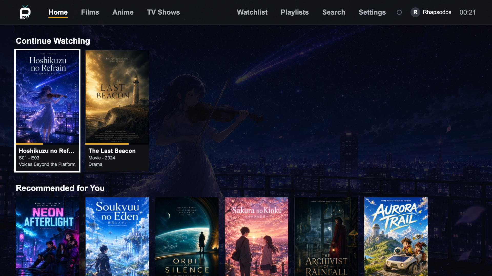
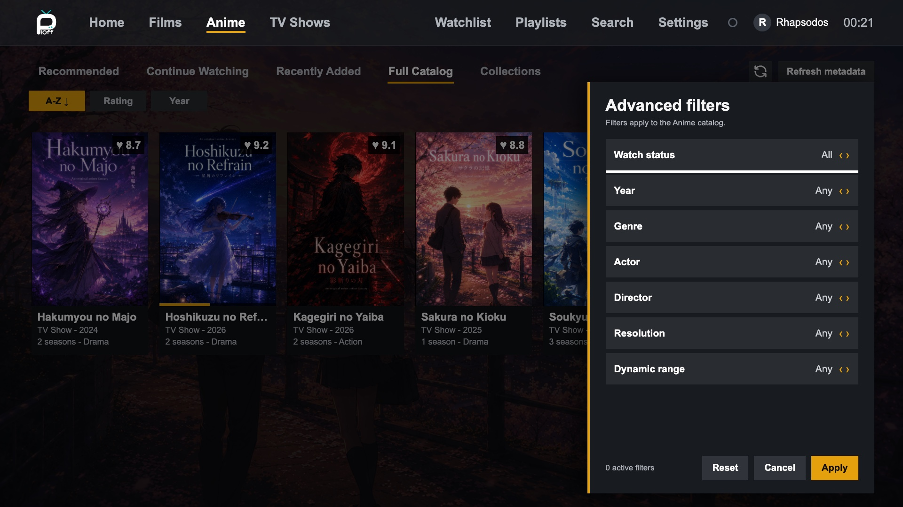
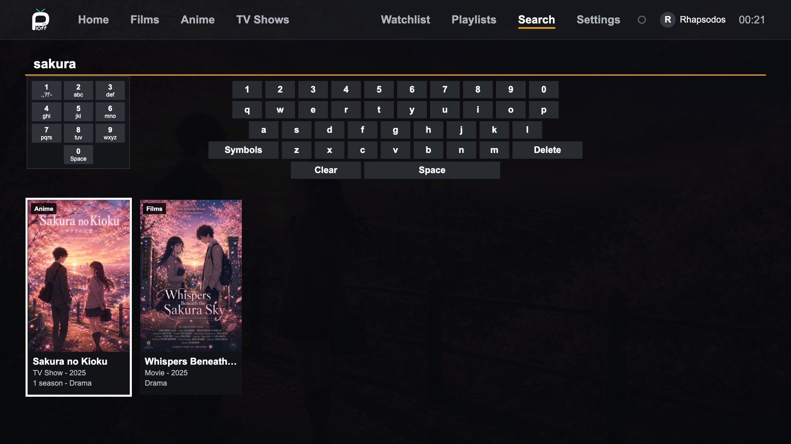
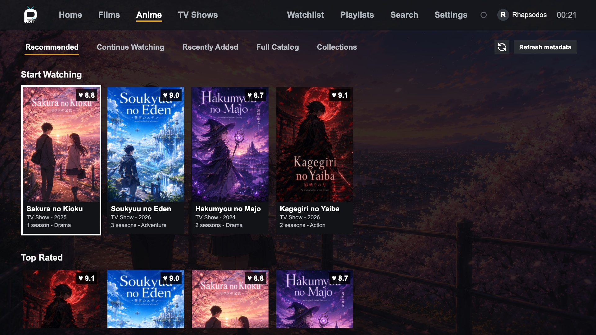
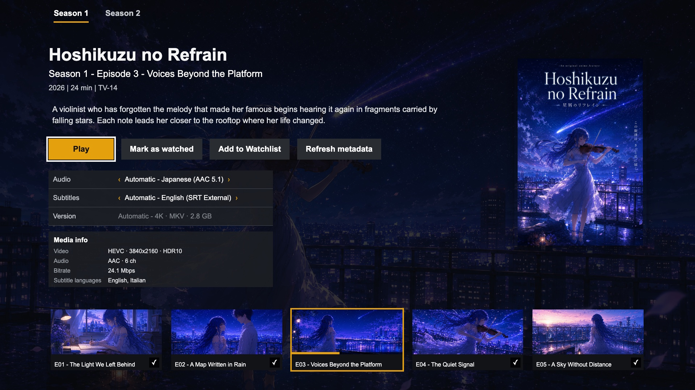
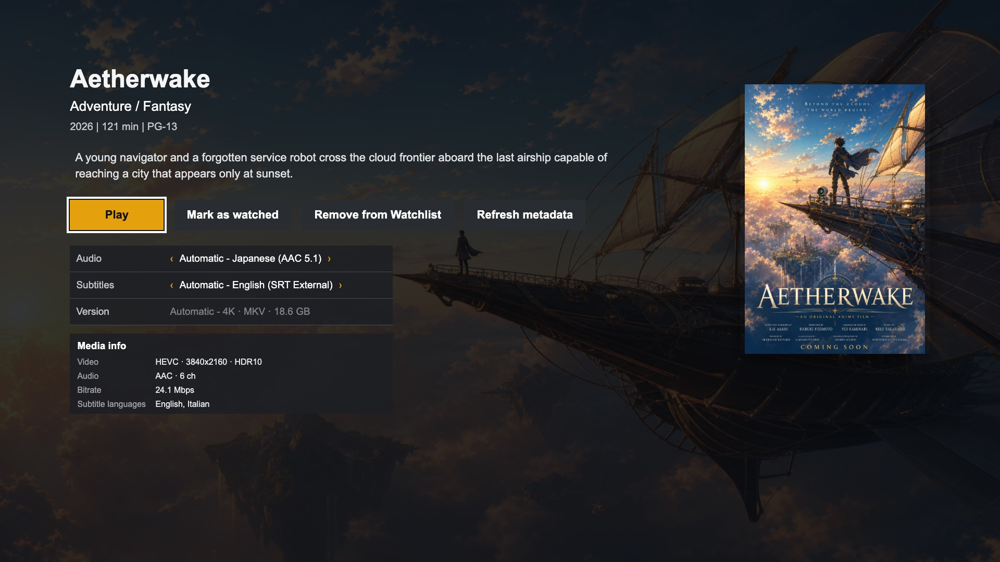
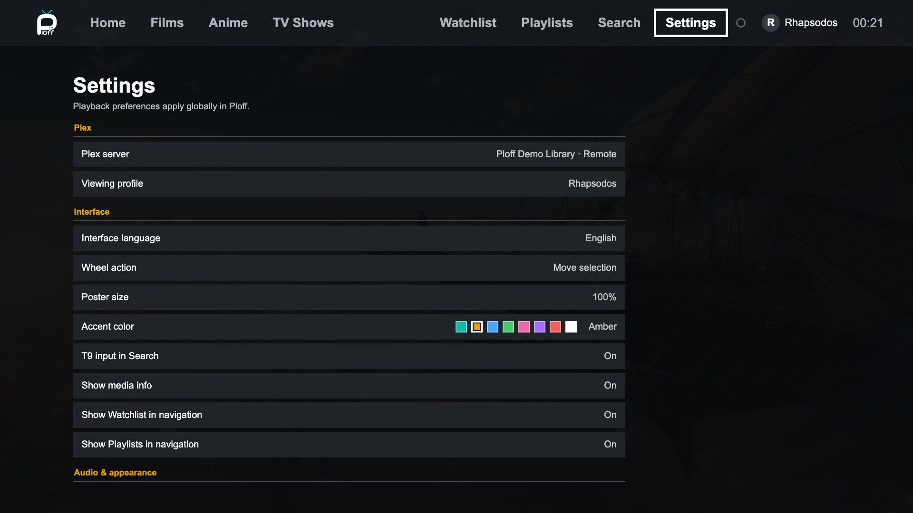

<p align="center">
  
</p>

<h1 align="center">Ploff for Plex</h1>
<p align="center"><strong>An offline-capable, remote-first Plex client built for legacy LG webOS TVs.</strong></p>

<p align="center">
  <a href="https://github.com/lucabravi/ploff-webos/actions/workflows/ci.yml"></a>
  <a href="https://github.com/lucabravi/ploff-webos/releases"></a>
  <a href="LICENSE"></a>
</p>

<p align="center"><em>Ploff is an unofficial community project and is not affiliated with or endorsed by Plex, Inc.</em></p>

## Contents

- [Why Ploff](#why-ploff)
- [Screenshots](#screenshots)
- [Features](#features)
- [Requirements](#requirements)
- [Installation](#installation)
- [First launch](#first-launch)
- [Compatibility notes](#compatibility-notes)
- [Security](#security)
- [Development](#development)
- [Project structure and documentation](#project-structure-and-documentation)
- [Contributing](#contributing)
- [License](#license)

## Why Ploff

- **Built for the TV you already own.** Ploff is designed specifically for the
  Chrome 53 WebView found on legacy LG webOS TVs, with a lightweight interface
  and no runtime dependencies.
- **Works locally without the cloud.** Local server discovery and LAN playback
  require no Plex account. Previously linked Plex Home profiles remain
  available when Plex cloud services are temporarily unreachable.
- **Designed around a remote, not a mouse.** Navigation, playback, and search,
  including optional classic T9 input, support directional remotes and the LG
  Magic Remote pointer from day one.
- **No account required.** Point Ploff at a local Plex Media Server and go.
  Optional Plex linking adds Home profiles, Watchlist, remote servers, Relay
  failover, and improved multilingual search.

## Screenshots



<details>
<summary><strong>Click for more screenshots</strong> — browse the interface gallery</summary>
<br>

<table>
  <tr>
    <td width="50%"></td>
    <td width="50%"></td>
  </tr>
  <tr>
    <td align="center"><strong>Advanced catalog filters</strong></td>
    <td align="center"><strong>Search and T9 input</strong></td>
  </tr>
  <tr>
    <td width="50%"></td>
    <td width="50%"></td>
  </tr>
  <tr>
    <td align="center"><strong>Library recommendations</strong></td>
    <td align="center"><strong>Series detail and episode navigation</strong></td>
  </tr>
  <tr>
    <td width="50%"></td>
    <td width="50%"></td>
  </tr>
  <tr>
    <td align="center"><strong>Movie detail and playback choices</strong></td>
    <td align="center"><strong>Application settings</strong></td>
  </tr>
</table>

</details>

Screenshots use a fictional demo library and contain no personal Plex data.
All titles, descriptions, and artwork shown are fictional and were created for
the demo to avoid using copyrighted media.

## Features

### Library and discovery

- Home, search, libraries, collections, playlists, and Watchlist, all built TV-first
- Optional classic T9 numeric search input, for remotes without a pointer
- Progressive artwork, adjustable card sizes, backdrops, and media themes

### Playback

- Direct Play, Direct Stream, transcoding fallback, and playback diagnostics
- Quality, version, audio, subtitle, synchronization, chapter, and resume controls
- Remote-friendly choice dialogs for tracks, playback, and application settings
- Playback progress, watched state, next-episode autoplay, and metadata refresh

### Remote and navigation

- Directional remotes, media keys, LG Magic Remote pointer, and wheel support

### Account and connectivity

- Local server discovery, Plex Home profiles, and automatic LAN/direct/Relay failover
- Fully usable without a Plex account

### Interface

- English, Italian, Spanish, French, German, Brazilian Portuguese, Japanese, and Korean

## Requirements

- Plex Media Server reachable from the TV
- LG TV with [Developer Mode enabled](https://webostv.developer.lge.com/develop/getting-started/developer-mode-app)
- Docker (recommended), or Node.js and the LG webOS CLI for manual installation

On the TV, open the Developer Mode app and enable both **Dev Mode Status** and
**Key Server** before installing Ploff.

## Installation

### Docker (recommended)

This method requires only Docker on the computer. Node.js, the LG webOS CLI,
and the Ploff package are contained in the installer image.

1. Install and start Docker.
2. Install the LG Developer Mode app, sign in, and enable **Dev Mode Status**.
3. Enable **Key Server** and keep its screen open for the first installation.
4. Run:

   ```sh
   docker run --rm -it \
     -v ploff-webos-data:/data \
     ghcr.io/lucabravi/ploff-webos-installer:latest
   ```

5. Enter the TV IP address and the six-character passphrase shown by the
   Developer Mode app.

The installer retrieves the TV key, builds and verifies the generic IPK,
installs Ploff, and launches it.

The `ploff-webos-data` volume retains only the webOS device configuration and
key. Use the same command for future updates; pairing is skipped while the key
remains valid, and the installer verifies the stored key before every update.
If the Developer Mode session or key expires, renew it on the TV, enable Key
Server, and run the command again to pair automatically.

For automation, prompts can be supplied through `PLOFF_TV_IP`,
`PLOFF_TV_PASSPHRASE`, and optionally `PLOFF_DEVICE`. Run the image with
`help`, `pair`, or `package` instead of the default `install` command to inspect
the available operations.

<details>
<summary><strong>Manual installation</strong></summary>
<br>

Install Node.js and the [LG webOS CLI](https://github.com/webos-tools/cli):

```sh
npm install -g @webos-tools/cli@3.2.5
ares-setup-device
ares-novacom --getkey --device my-tv
```

Keep Key Server enabled while running `ares-novacom`. When prompted, enter the
passphrase shown by the Developer Mode app.

Download the IPK and `SHA256SUMS` from
[GitHub Releases](https://github.com/lucabravi/ploff-webos/releases), verify the
download, then install and launch it:

```sh
shasum -a 256 --check SHA256SUMS # macOS
# sha256sum --check SHA256SUMS   # Linux
ares-install --device my-tv io.github.rhapsodos.ploff_<version>_all.ipk
ares-launch --device my-tv io.github.rhapsodos.ploff
```

Replace `my-tv` with the name configured in `ares-setup-device`.

Every tagged version publishes a generic IPK, checksum, and multi-architecture
Docker installer. Release packages contain no Plex address or credentials.

</details>

## First Launch

No Plex address or token is embedded in Ploff. On first launch, the app finds
local servers and can work without a Plex account. Linking at `plex.tv/link`
adds Plex Home profiles, remote servers, Watchlist, remote/Relay failover, and
improved multilingual search through localized titles and aliases. Search
results are still limited to media available on the active server. Servers can
always be entered or changed manually in Settings.

Previously linked profiles and local playback remain available if Plex cloud
services are offline. Search also remains local; online title aliases are shown
only after matching media is confirmed on the active server.

## Compatibility Notes

Codec support depends on the TV and Plex Media Server; unsupported media can be
transcoded by Plex. Applications installed through LG Developer Mode remain
subject to the Developer Mode session and package expiration rules. Linking a
Plex account requires internet initially, while previously cached profiles and
local playback remain available offline.

## Security

- Plex account tokens and cached Plex Home profiles are stored in the TV
  application's local storage; they are **not encrypted** by Ploff.
- Generated IPK files never contain a Plex address or credentials.
- Local HTTP connections remain supported for older TVs, but an untrusted LAN
  could observe metadata and authenticated media URLs. Prefer Plex HTTPS
  endpoints on shared networks, and treat the TV and home LAN as trusted
  devices.

See [SECURITY.md](SECURITY.md) for the full threat model and private reporting
instructions.

## Development

### Build from source

```sh
npm ci
npm run build:app
./scripts/package-tv-shell.sh
./scripts/install-webos.sh my-tv
```

`install-webos.sh` builds, installs, and launches the app. Generated packages
always use neutral defaults and exclude `app/config.local.js`.

Application code is maintained as responsibility-based fragments in
`app/source/`; `app/app.js` is the generated ES5 bundle shipped to the TV.

### Tests and verification

Node.js is required only for development and tests, not when using the Docker
installer.

```sh
npm ci
npm run verify
```

`npm run verify` checks that the generated application bundle is current, then runs:

1. ESLint
2. JavaScript type-checking
3. The complete test suite
4. Chrome 53 compatibility checks
5. Publishable repository hygiene checks

### Local preview

```sh
./scripts/preview-local.sh
```

The script serves the project on `http://127.0.0.1:8098/app/` and opens the
browser when supported. Pass a different port as its first argument, for example
`./scripts/preview-local.sh 9000`. Browser preview cannot perform webOS multicast
discovery, but a server can be entered manually and is retained in local
storage.

## Project Structure and Documentation

- [docs/architecture.md](docs/architecture.md) — runtime components and design rationale
- [docs/playback-invariants.md](docs/playback-invariants.md) — TV-verified seek and resume behavior
- [docs/testing.md](docs/testing.md) — release test matrix
- [CHANGELOG.md](CHANGELOG.md) — release history
- [CONTRIBUTING.md](CONTRIBUTING.md) — contribution requirements

## Contributing

Bug reports and pull requests are welcome. Please read
[CONTRIBUTING.md](CONTRIBUTING.md) for the coding style, testing, and verification
requirements (`npm run verify`) applied to every change.

## License

Released under the [MIT License](LICENSE).

Plex and Plex Media Server are trademarks of Plex, Inc. Ploff is independently
developed and is not endorsed by Plex, Inc.
