<p align="center">
  
</p>

<h1 align="center">Ploff for Plex</h1>
<p align="center"><strong>A lightweight, customizable, TV-first Plex client for LG webOS.</strong></p>

<p align="center">
  <a href="https://github.com/lucabravi/ploff-webos/actions/workflows/ci.yml"></a>
  <a href="https://github.com/lucabravi/ploff-webos/releases"></a>
  <a href="LICENSE"></a>
</p>

<p align="center"><em>Ploff is an unofficial community project and is not affiliated with or endorsed by Plex, Inc.</em></p>

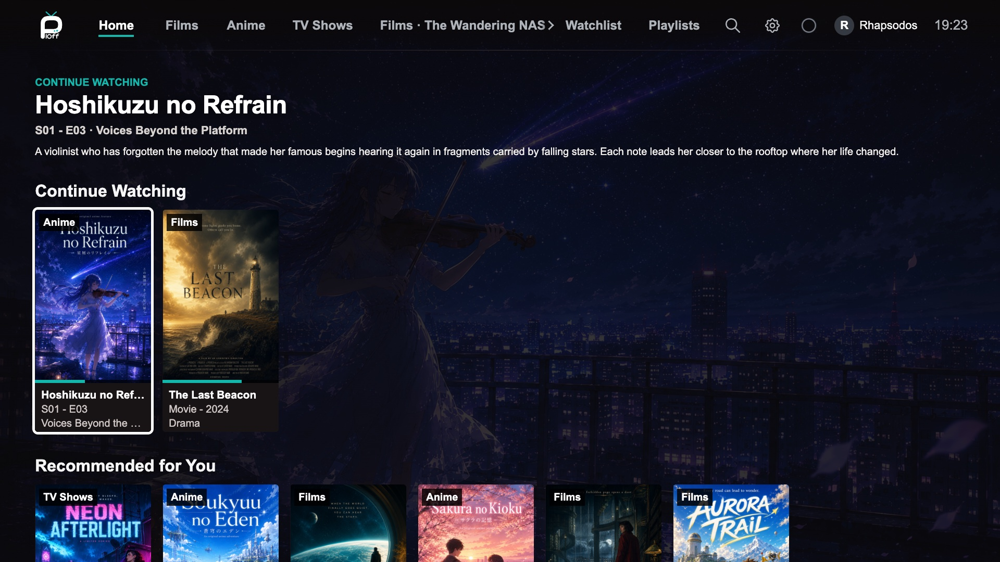

## Contents

- [Why Ploff](#why-ploff)
- [Features](#features)
- [Screenshots](#screenshots)
- [Requirements](#requirements)
- [Installation](#installation)
- [Installation troubleshooting](#installation-troubleshooting)
- [First launch](#first-launch)
- [Compatibility notes](#compatibility-notes)
- [Security](#security)
- [Privacy](PRIVACY.md)
- [Architecture at a glance](#architecture-at-a-glance)
- [Development](#development)
- [Project structure and documentation](#project-structure-and-documentation)
- [Contributing](#contributing)
- [License](#license)

## Why Ploff

- **Local-first, even when Plex sign-in is unavailable.** Ploff can discover, browse,
  and play from a Plex server on the same network without depending on cloud services.
  A Plex login outage therefore does not lock you out while your local server is still
  online and reachable.
- **Fast on the TV you already own.** Ploff is built specifically for LG webOS and
  remains compatible with the older Chrome 53-based TVs that many modern web apps
  leave behind. Pages and artwork are prepared progressively so you can start
  browsing without waiting for every server to finish.
- **One place for all your Plex libraries.** Browse owned and shared servers from the
  same navigation bar, or optionally combine matching libraries into a single view.
  Ploff still remembers which server owns every playable copy.
- **Original quality whenever possible.** Ploff prefers Direct Play and Direct Stream
  when the TV supports the media. Optional on-device text subtitle rendering can also
  avoid subtitle-driven video transcoding in compatible cases.
- **Link an account only if you want the extras.** Account linking is optional and
  adds Home profiles, Watchlist, remote and shared servers, Relay fallback, and
  broader multilingual search.
- **Made for a remote.** Directional controls, media keys, Back navigation, optional
  T9 search, and the LG Magic Remote pointer are treated as primary input methods.
- **Comfortably customizable.** Seven visual themes, accent colors, card size,
  artwork quality, text size, animations, and subtitle presentation can all be tuned
  for the TV and the room.

## Features

### Library and discovery

- Home, search, libraries, collections, playlists, and Watchlist in a TV-first
  interface
- Sorting, watched filters, advanced catalog filters, and optional classic T9 search
- Progressive artwork that prioritizes what is visible and prepares nearby pages in
  the background
- Multi-server results shown separately or combined according to your preferences,
  appearing as reachable servers respond without letting a slow or offline secondary
  server block the rest of the interface

### Media details

- Seasons, episodes, alternate media versions, audio and subtitle tracks, watched
  state, Watchlist actions, and resume choices in one screen
- A dedicated **More details** view for genres, directors, cast, trailers, and extras
- Episode rows, cast, and extras with consistent remote and pointer navigation
- Confirmed actions for marking individual media, earlier episodes, or a whole season
  watched or unwatched

### Playback

- Direct Play, Direct Stream, and Plex transcoding fallback with selectable quality
  and media versions
- Resume, audio, subtitles, subtitle synchronization, chapter previews, Skip Intro,
  Skip Credits, and playback diagnostics
- Playback queues for series, collections, and playlists, with configurable Up Next
  presentation and automatic episode progression
- Optional on-device rendering for SRT/WebVTT and experimental ASS/SSA subtitles
- Automatic compatibility memory that avoids retrying playback modes already known
  not to work for a format or file
- Progress and watched-state synchronization with Plex

### Remote and navigation

- Directional remotes, media keys, LG Magic Remote pointer, and wheel support

### Account and connectivity

- Local server discovery, Plex Home profiles, and automatic preference for local,
  direct, and Relay connections in that order
- Home and Search across enabled servers, retaining useful results when another server
  is slow or unavailable
- Configurable library visibility, aliases, icons, server names, ordering, and optional
  merging of matching libraries
- Full local use without linking a Plex account
- Optional per-device settings backup and restore through a dedicated Plex playlist

### Interface

- Seven themes: Immersive (the default), Premiere, Aurora, Mahogany, Atelier, Nova,
  and Simple
- English, Italian, Spanish, French, German, Brazilian Portuguese, Japanese, and
  Korean
- Automatic update notifications, plus a manual check and release QR code in Settings

## Screenshots

<table>
  <tr>
    <td width="25%" align="center"><a href="docs/screenshots/catalog-filters.jpg">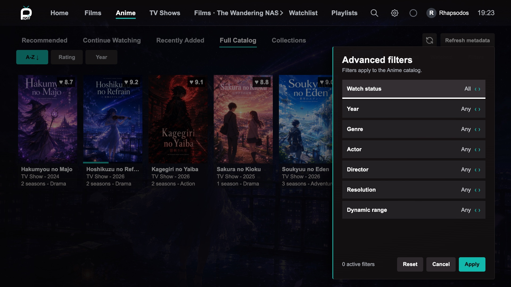</a><br><sub><strong>Advanced catalog filters</strong></sub></td>
    <td width="25%" align="center"><a href="docs/screenshots/search-t9.jpg">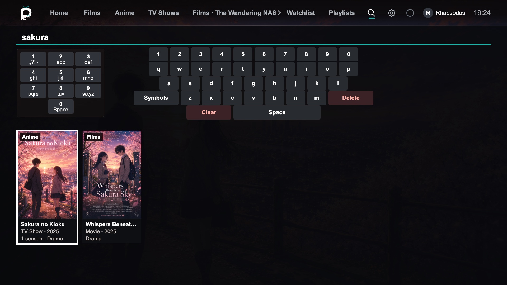</a><br><sub><strong>Search and T9 input</strong></sub></td>
    <td width="25%" align="center"><a href="docs/screenshots/library.jpg">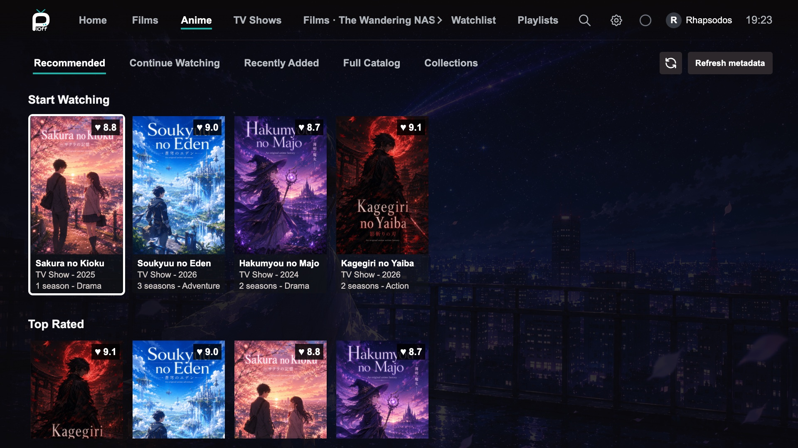</a><br><sub><strong>Library recommendations</strong></sub></td>
    <td width="25%" align="center"><a href="docs/screenshots/series-detail.jpg">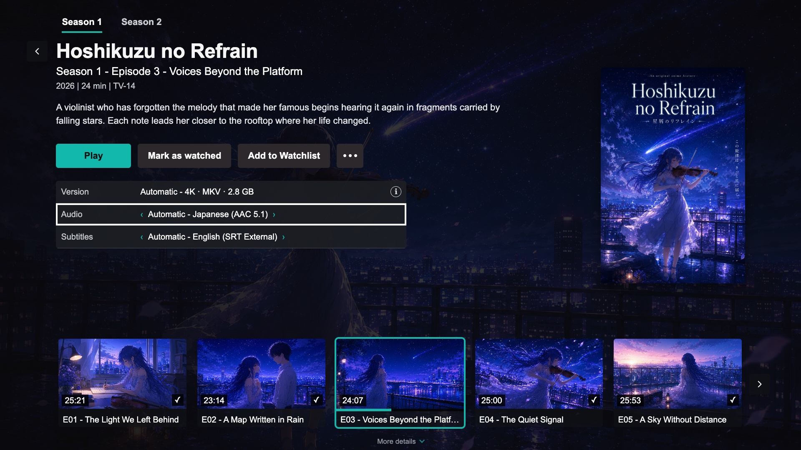</a><br><sub><strong>Series detail</strong></sub></td>
  </tr>
  <tr>
    <td width="25%" align="center"><a href="docs/screenshots/player.jpg">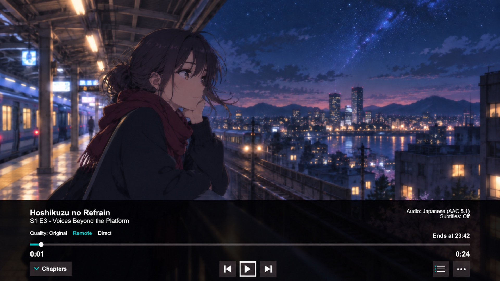</a><br><sub><strong>Player controls</strong></sub></td>
    <td width="25%" align="center"><a href="docs/screenshots/queue-up-next.jpg">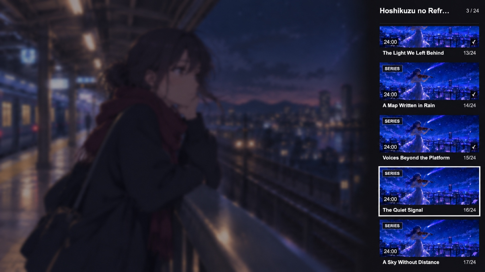</a><br><sub><strong>Playback queue and Up Next</strong></sub></td>
    <td width="25%" align="center"><a href="docs/screenshots/movie-detail.jpg">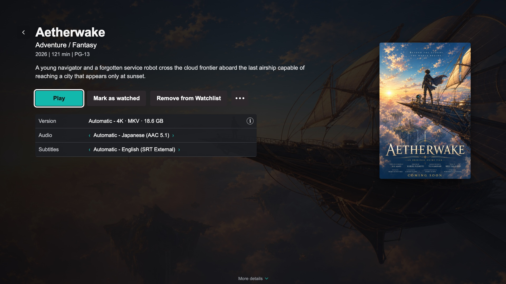</a><br><sub><strong>Movie detail</strong></sub></td>
    <td width="25%" align="center"><a href="docs/screenshots/settings.jpg">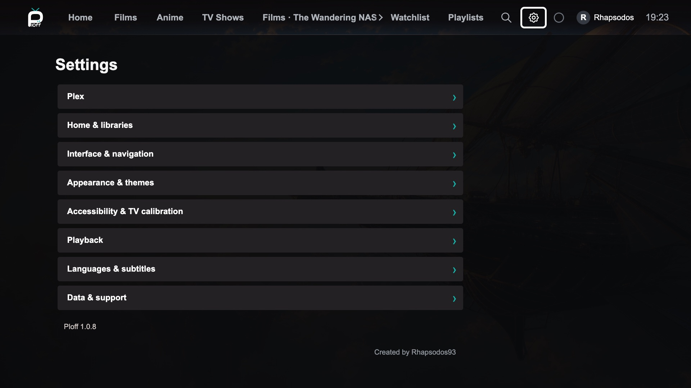</a><br><sub><strong>Application settings</strong></sub></td>
  </tr>
  <tr>
    <td colspan="2" width="50%" align="center"><a href="docs/screenshots/more-details.jpg">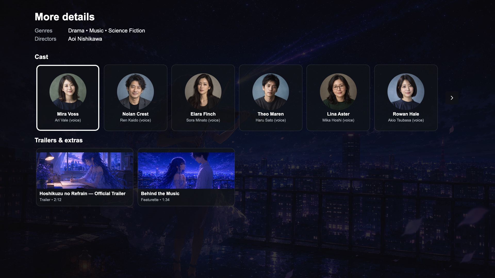</a><br><sub><strong>Cast and extras</strong></sub></td>
    <td colspan="2" width="50%" align="center"><a href="docs/screenshots/servers-libraries.jpg">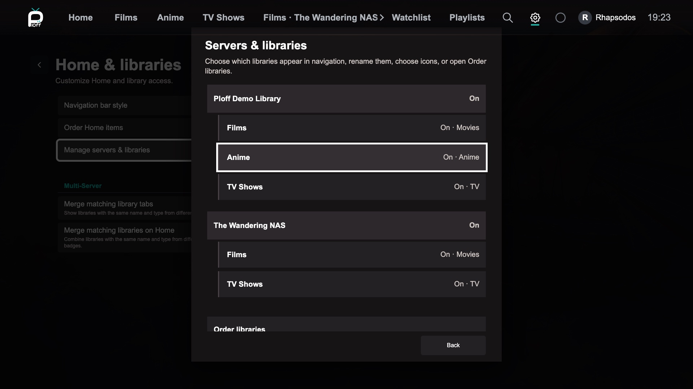</a><br><sub><strong>Servers and libraries</strong></sub></td>
  </tr>
</table>

<p align="center"><a href="docs/screenshots/player-chapters.jpg">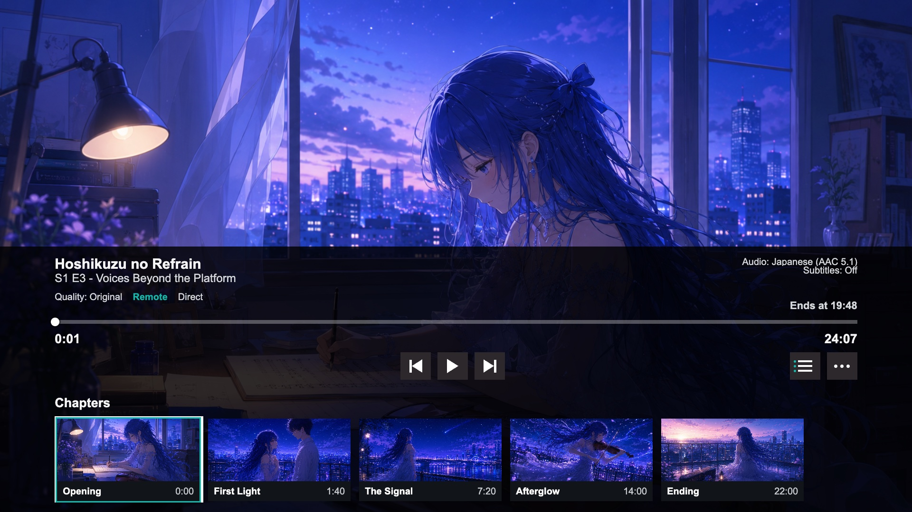</a><br><sub><strong>Chapter navigation</strong></sub></p>

<p align="center"><em>Click any preview to open the full-size screenshot.</em></p>

Screenshots use a fictional demo library and contain no personal Plex data.
All titles, descriptions, and artwork shown are fictional and were created for
the demo to avoid using copyrighted media.

## Requirements

- Plex Media Server reachable from the TV
- LG TV with [Developer Mode enabled](https://webostv.developer.lge.com/develop/getting-started/developer-mode-app)
- Docker (recommended), or Node.js and the LG webOS CLI for manual installation

On the TV, open the Developer Mode app and enable both **Dev Mode Status** and
**Key Server** before installing Ploff.

## Installation

### Docker (recommended)

This method requires only Docker on the computer. Node.js, the LG webOS CLI,
and the Ploff package are contained in the installer image.

1. Install and start Docker.
2. Install the LG Developer Mode app, sign in, and enable **Dev Mode Status**.
3. Enable **Key Server** and keep its screen open for the first installation.
4. Run:

   ```sh
   docker run --rm -it \
     -v ploff-webos-data:/data \
     ghcr.io/lucabravi/ploff-webos-installer:latest
   ```

5. Enter the TV IP address and the six-character passphrase shown by the
   Developer Mode app.

The installer retrieves the TV key, builds and verifies the generic IPK,
installs Ploff, and launches it.

The `ploff-webos-data` volume retains only the webOS device configuration and
key. Use the same command for future updates; pairing is skipped while the key
remains valid, and the installer verifies the stored key before every update.
If the Developer Mode session or key expires, renew it on the TV, enable Key
Server, and run the command again to pair automatically.

For automation, prompts can be supplied through `PLOFF_TV_IP`,
`PLOFF_TV_PASSPHRASE`, and optionally `PLOFF_DEVICE`. Run the image with
`help`, `pair`, or `package` instead of the default `install` command to inspect
the available operations.

<details>
<summary><strong>Manual installation</strong></summary>
<br>

Install Node.js and the [LG webOS CLI](https://github.com/webos-tools/cli):

```sh
npm install -g @webos-tools/cli@3.2.5
ares-setup-device
ares-novacom --getkey --device my-tv
```

Keep Key Server enabled while running `ares-novacom`. When prompted, enter the
passphrase shown by the Developer Mode app.

Download the IPK, `SHA256SUMS`, and `SBOM.spdx.json` from
[GitHub Releases](https://github.com/lucabravi/ploff-webos/releases), verify the
download and GitHub build provenance, then install and launch it:

```sh
shasum -a 256 --check SHA256SUMS # macOS
# sha256sum --check SHA256SUMS   # Linux
gh attestation verify io.github.rhapsodos.ploff_<version>_all.ipk --repo lucabravi/ploff-webos
ares-install --device my-tv io.github.rhapsodos.ploff_<version>_all.ipk
ares-launch --device my-tv io.github.rhapsodos.ploff
```

Replace `my-tv` with the name configured in `ares-setup-device`.

Every tagged version publishes a generic IPK, checksums, an SPDX JSON SBOM, and a
multi-architecture Docker installer. GitHub artifact attestations bind the IPK
and published container digest to the release workflow and source commit. Release
packages contain no Plex address or credentials.

</details>

## Installation Troubleshooting

If installation fails, check the TV-side Developer Mode state before changing Ploff:

- **TV cannot be reached:** confirm the TV and computer are on the same reachable
  network, verify the current TV IP in the Developer Mode app, and make sure **Dev
  Mode Status** is enabled. For a manual CLI setup, `ares-device --system-info
  --device my-tv` is a quick connectivity check.
- **Pairing / `ares-novacom --getkey` fails:** enable **Key Server**, keep its screen
  open, and use the current six-character passphrase. With Docker, rerun the installer
  with the `pair` command; it updates the stored device address and retrieves a fresh
  key.
- **A previously working install asks to pair again:** the Developer Mode session/key
  may have expired or the TV IP may have changed. Renew Developer Mode on the TV,
  enable Key Server, then pair again. The persistent Docker volume can be reused.
- **`ares-install` or launch fails after a long idle period:** first verify the
  Developer Mode session and device connection. Re-pair before rebuilding the package;
  packaging does not repair an expired TV key.
- **Non-interactive Docker use fails before pairing:** provide `PLOFF_TV_IP` and
  `PLOFF_TV_PASSPHRASE`; optionally set `PLOFF_DEVICE` when maintaining more than one
  configured TV.

For manual installations, `ares-setup-device --listfull` shows the configured device
record. Do not place TV passphrases, private keys, Plex tokens, or personal server
addresses in issues, logs, or repository files.

## First Launch

Ploff contains no preconfigured Plex address or account token. On first launch,
it looks for Plex servers on the local network and can be used without linking a
Plex account. A server can also be entered manually in Settings.

Linking through `plex.tv/link` is optional. It adds Plex Home profiles, Watchlist,
remote and shared servers, Relay fallback, and search through localized Plex titles
and aliases. You can then choose which libraries appear in navigation and whether
matching libraries from different servers should be shown together.

Once linked, cached profiles and local playback remain available during a Plex cloud
outage. Search and browsing also keep results returned by reachable servers when
another server is slow or offline.

## Compatibility Notes

Codec support depends on the TV and Plex Media Server; unsupported media can be
transcoded by Plex. Applications installed through LG Developer Mode remain
subject to the Developer Mode session and package expiration rules. Linking a
Plex account requires internet initially, while previously cached profiles and
local playback remain available offline.

Ploff currently focuses on films and TV libraries. Live TV/DVR, music libraries,
photo libraries, casting, and Watch Together are not supported.

## Security

- Plex tokens and cached Home profiles are stored in private app-owned webOS
  storage, not in browser `localStorage`.
- If that private storage is unavailable, credentials remain in memory only for
  the current session.
- Browser-preview sign-in support is development-only and is excluded from the TV
  package.
- Release packages are generic and never contain a Plex address or credentials.
- Local HTTP connections remain supported for older TVs, but an untrusted LAN
  could observe metadata and authenticated media URLs. Prefer Plex HTTPS
  endpoints on shared networks, and treat the TV and home LAN as trusted
  devices.

See [SECURITY.md](SECURITY.md) for the full threat model and private reporting
instructions, and [PRIVACY.md](PRIVACY.md) for the data-handling policy.

## Architecture at a Glance

Ploff deliberately keeps the installed TV runtime small and explicit:

```text
LG webOS TV / Chrome 53 compatibility baseline
        |
        v
app/index.html + app/styles.css + generated app/app.js
        |
        +--> Core features --> shared TV views / remote + pointer input
        +--> deferred app/player.js --> Player composition and playback
        |
        +--> Plex HTTP client ----------------------> Plex Media Server
        |
        +--> webOS Luna service -- UDP GDM --------> local Plex discovery
        |
        +--> Settings / DB8 / bounded local state
```

`app/coordinator/application-controller.js` is the composition root: it wires focused
feature controllers together but does not own their Plex requests, DOM, timers, or
private state. It also owns the single deferred-Player readiness transition and
completion-driven post-Home warm chain. Browser runtime code remains dependency-free ES5. `app/app.js`,
`app/player.js`, and `app/styles.css` are checked-in generated artifacts and must never
be edited directly. Player code is warmed by the post-Home background chain, or loaded
immediately when Detail or playback needs it; enabled local ASS prewarm remains in Core and
independent of that load.

Local Plex discovery and LAN playback do not require Plex cloud services. Plex linking
is optional and adds Home profiles, Watchlist, remote servers, Relay failover, and
cloud-assisted title aliases. Linked accounts also enable multi-server Home/Search
and optional merging of matching libraries while preserving concrete source ownership.
See [docs/architecture.md](docs/architecture.md) for the full ownership/data-flow model,
[docs/multi-server.md](docs/multi-server.md) for current multi-server behavior, and
[docs/README.md](docs/README.md) for the current documentation map.

## Development

### Build from source

```sh
npm ci
npm run build:styles
npm run build:app
./scripts/package-tv-shell.sh
./scripts/install-webos.sh my-tv
```

`install-webos.sh` builds, installs, and launches the app. Generated packages
always use neutral defaults and exclude `app/config.local.js`.

Application coordination is maintained as complete responsibility-based UMD
modules in `app/coordinator/`, with focused support modules under `app/`;
`app/app.js` is the generated ES5 bundle shipped to the TV. The legacy
`app/source/` directory must not be reintroduced.

### Tests and verification

Node.js 20 or newer is required only for development and tests, not when using
the Docker installer.

```sh
npm ci
npm run verify
```

`npm run verify` checks that the generated application bundle is current, then runs:

1. ESLint
2. JavaScript type-checking
3. The complete test suite
4. Chrome 53 compatibility checks
5. Publishable repository hygiene checks

Before a release, or after changing asynchronous lifecycle and teardown code, run
the extended gate:

```sh
npm run test:pre-release
```

It runs the complete verification suite followed by the forced-GC memory lifecycle
stress test documented in `docs/testing.md`. To build a local release artifact after metadata and
physical signoff are ready, use `npm run release:package`; it rebuilds generated assets, runs the
pre-release gate, packages and inspects the IPK, and writes `dist/SHA256SUMS` without changing Git
or the application version.

### Local preview

```sh
./scripts/preview-local.sh
```

The script serves the project on `http://127.0.0.1:8098/app/` and opens the
browser when supported. Pass a different port as its first argument, for example
`./scripts/preview-local.sh 9000`. Browser preview cannot perform webOS multicast
discovery, but a server can be entered manually and is retained in local
storage.

To stage and open the app in the macOS webOS TV Simulator, use:

```sh
./scripts/install-simulator.sh
```

The script rebuilds the generated assets, imports the app through the simulator's
virtual remote, and leaves the physical TV untouched. Use `--stage-only` to only
prepare the import directory.

## Project Structure and Documentation

- [docs/README.md](docs/README.md) — authoritative current-document index
- [docs/architecture.md](docs/architecture.md) — runtime components and design rationale
- [docs/features.md](docs/features.md) — current viewer-facing capabilities
- [docs/themes.md](docs/themes.md) — visual-theme architecture, isolation rules, and extension workflow
- [docs/settings.md](docs/settings.md) — persisted Settings schema, migrations, and extension workflow
- [docs/diagnostics.md](docs/diagnostics.md) — privacy-safe support reports and diagnostics export workflow
- [docs/playback-invariants.md](docs/playback-invariants.md) — TV-verified seek and resume behavior
- [docs/testing.md](docs/testing.md) — release test matrix
- [CHANGELOG.md](CHANGELOG.md) — release history
- [CONTRIBUTING.md](CONTRIBUTING.md) — contribution requirements

## Contributing

Bug reports and pull requests are welcome. Please read
[CONTRIBUTING.md](CONTRIBUTING.md) for the coding style, testing, and verification
requirements (`npm run verify`) applied to every change.

## License

Released under the [MIT License](LICENSE).

Packaged third-party components retain their own licenses and attribution in
[`app/vendor/THIRD_PARTY_NOTICES.txt`](app/vendor/THIRD_PARTY_NOTICES.txt), including
the corresponding-source provenance for the ASS renderer and the OFL-1.1 fallback font.

Plex and Plex Media Server are trademarks of Plex, Inc. Ploff is independently
developed and is not endorsed by Plex, Inc.
